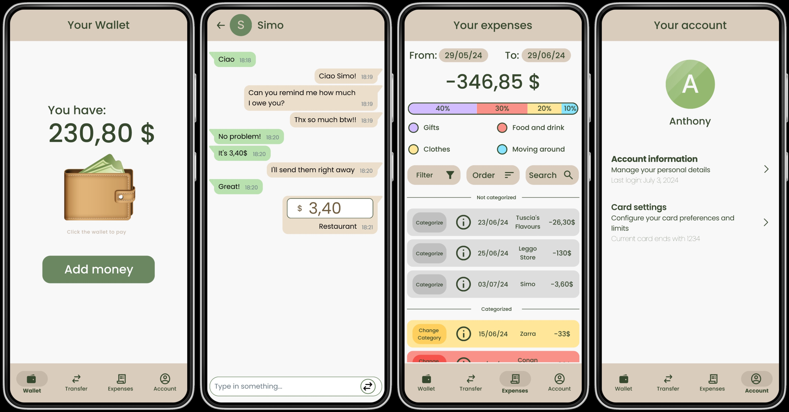
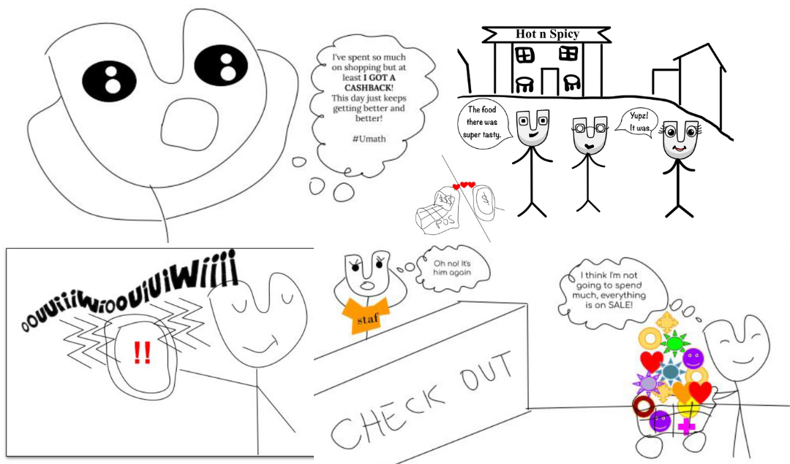

# TriMoney-Financial-App

> 'cause money doesn't grow on trees!

## Abstract

TriMoney is an app designed to make money management easier and more conscious for users, featuring an appealing UI with functionalities to avoid falling into bad habits and money anxiety. The report will describe the Need Finding, Storyboarding, Prototyping, Evaluation and Production phases.
 
 
***Please read the [PAPER] (DA METTERE) for the entire documentation of the project***

## Need Finding

Need Finding is crucial in design thinking, focused on identifying users’ genuine needs. Through structured interviews, designers uncover latent needs, ensuring solutions address real-world problems.

- Interviews
- AI Personas: ChatGPT, Gemini
- Questionnaire

## Storyboarding

In the realm of mobile app development, effective design and user experience are pivotal. Storyboarding serves as a foundational tool in this process, visually outlining app interactions and flow.

## Prototyping

1. Incremental Approach: all the different functions are added to the prototype one at a time
2. Paper Prototyping: each team will do fast paper prototyping of the task assigned to them.
3. Internal Evaluation: sharing the prototypes with the whole group, trying to see how they could be
improved
  * IF something could be better: Go back to Paper Prototyping
  * ELSE: Go forward
5. External Evaluation (3 users):
  * (a) Think Aloud: recording the interviewee
  * (b) Past-Task Walkthrough
    * IF something could be better: Go back to Paper Prototyping
    * ELSE: Go forward
6. Figm-it: make the paper prototype on Figma

The full Figma prototype can be found at [this link](https://drive.google.com/drive/folders/1bfrFxzuzANDSYAnbGFRpThcnNnhTL0z1?usp=sharing).

## Evaluation

User evaluation was carried out using the Think Aloud method, for approximately three recorded evaluation sessions per feature, organized in folders for easy access.
The response to the paper prototypes was positive enough to start the Production phase in FlutterFlow.  
Every recording can be found following [this link] (DA METTERE).

## App Development

Flutterflow is a software to create UIs and apps with the use of Google Firebase backend. A mixture of its no-code and custom (classic) code was used to develop the app.  
The APK of the app can be found [here] (DA METTERE).

## License

TriMoney is released under the [MIT License](../LICENSE).
